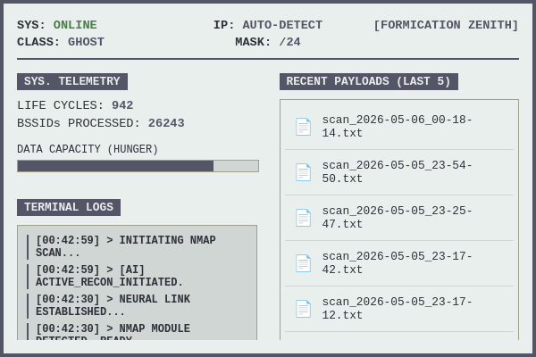

        _   __     __       __    _ 
       / | / /___ / /______/ /_  (_)
      /  |/ / _ \/ __/ ___/ __ \/ / 
     / /|  /  __/ /_/ /__/ / / / /  
    /_/ |_/\___/\__/\___/_/ /_/_/   


Autonomous AI-Driven Network Reconnaissance & Topology Mapping Node

**[ Update: Now available on the AUR via `yay -S netchi` ]**

## Table of Contents
- [Architecture & Tech Stack](#architecture--tech-stack)
- [Biological Mechanics & Q-Table Engine](#biological-mechanics--q-table-engine)
- [Telemetry Dashboard & Operation](#telemetry-dashboard--operation)
- [System Directories & Configuration](#system-directories--configuration)
- [Security Posture & Permissions](#security-posture--permissions)
- [Installation](#installation)
- [Roadmap (v1.2)](#roadmap-v12)
- [About](#about)

 

*Netchi primary telemetry and logging interface.*

Netchi is an autonomous, background-running network reconnaissance tool disguised as a desktop virtual pet. Driven by a Reinforcement Learning engine (Q-Table), it passively monitors the local subnet, ingests broadcast packets to calculate network volatility, and autonomously schedules stealth `nmap` scans based on learned environmental states.

 

*Maturation event.*

--------------------------------------------------------------------
### Architecture & Tech Stack
--------------------------------------------------------------------
Netchi is written entirely in **Rust**, utilizing the Tauri framework (WebKit2GTK) for the frontend telemetry dashboard. 

**Why Rust?**
A network sniffer must run continuously in the background. Rust provides predictable, deterministic memory management without the overhead of a garbage collector. It allows the packet capture thread (`libpcap`) to run concurrently with the AI logic and the UI event loop with zero data races, maintaining a minimal CPU footprint.

--------------------------------------------------------------------
### Biological Mechanics & Q-Table Engine
--------------------------------------------------------------------
The internal AI operates on a 5-second tick loop. Its decision-making process is governed by a Q-Table that penalizes reckless scanning (which triggers self-imposed rate limits) and rewards passive listening in noisy environments or sleeping in quiet ones.

The entity undergoes a strict maturation process:
* **Egg Stage**: Lasts exactly 5 minutes (60 cycles). Requires absolute patience.
* **Baby Stage**: To mature into an Adult, the entity requires both time and data. It must survive for **5 hours** (3600 cycles) AND successfully ingest at least **1000 packets**. If the entity is not evolving, it is lacking either uptime or network traffic.
* **Adult Stage**: Unlocks full autonomous active scanning and dynamic environment classification.

Upon hatching from the Egg stage, the entity will randomly evolve into one of three currently available morphologies:
* **Ghost**
* **Duck**
* **Beagle**

*(More entity classes coming soon in v1.2).*

**Assets:** Pixel-art sprites and animations were drawn using [Aseprite](https://www.aseprite.org/). Massive thanks to David Capello and the Aseprite team for building the ultimate pixel art tool.

--------------------------------------------------------------------
### Telemetry Dashboard & Operation
--------------------------------------------------------------------
Once installed, Netchi can be launched via your desktop environment's application menu or by executing `netchi` directly in the terminal.

The application acts as a passive overlay. The frontend dashboard provides real-time telemetry:

* **Maturation State**: Visual indicator of the entity's current evolutionary stage.
* **Packet Ingestion Rate**: A live graph/counter of intercepted broadcast and multicast packets.
* **Q-Table State**: Current action probabilities based on environmental noise.
* **Action Logs**: Readout of initiated `nmap` scans and their targeted subnets.

Netchi is designed to run persistently. Closing the UI window does not terminate the background sniffing daemon unless explicitly configured to do so.

--------------------------------------------------------------------
### System Directories & Configuration
--------------------------------------------------------------------
Netchi strictly adheres to XDG Base Directory specifications. All operational data and configuration files are generated upon the first execution and are stored in:
`~/.local/share/netchi/`

Directory structure:
```text
~/.local/share/netchi/
├── config.toml         # Nmap parameters & environmental thresholds
└── netchi_memory.json  # Serialized Q-Table weights and maturation state
```

1. config.toml (Operational Parameters)
This file allows overriding the AI's internal thresholds:

- noise_threshold: Volume of broadcast/mDNS packets required per 30-second window to classify an environment as "Crowded" (e.g., 800-1500 for 5GHz Smart Homes; 50-200 for isolated networks).

- nmap_arguments: The command-line flags passed to the nmap binary.

  - Stealth/Fast (*Default*): ["-F", "-T4"]

  - Comprehensive: ["-p-", "-T4"]

  - *OS/Service Detection (High Latency)*: `["-sV", "-O", "-T3"]`

2. netchi_memory.json (Entity State)
This file contains the persistent state of the Reinforcement Learning engine.

Warning: Manually editing the Q-Table weights will disrupt the AI's learned behavior. To reset the entity to its Egg stage and clear all learned data, simply delete this file and restart the application.
  - *OS/Service Detection (High Latency)*: `["-sV", "-O", "-T3"]`

--------------------------------------------------------------------
### Security Posture & Permissions
--------------------------------------------------------------------
Packet sniffing and raw socket manipulation require elevated privileges. However, executing a GUI application (WebKit2GTK/Wayland/X11) as `root` is a critical security vulnerability and violates fundamental UNIX design principles.

To resolve this, Netchi relies on Linux Capabilities. By assigning `cap_net_raw` and `cap_net_admin` exclusively to the compiled binary, Netchi can interface with `libpcap` and execute active network scans as a standard user, completely sandboxing the UI framework from root access.

--------------------------------------------------------------------
### Installation
--------------------------------------------------------------------
[Baby Crying](docs/baby_crying.gif)
*Baby netchi crying, like you when compiling with an i5*.
(*netchi bin is there for you*.)

**Prerequisites:**
- With `yay` deps are downloaded automatically if necessary.

Ensure `nmap` and `libpcap` are installed system-wide.


## ARCH LINUX (AUR)
Available via the Arch User Repository (handles capabilities automatically).
```bash
yay -S netchi
```

## MANUAL BUILD - (SOURCE)
Requires cargo and npm.

```bash
git clone [https://github.com/YOUR_USERNAME/netchi.git](https://github.com/YOUR_USERNAME/netchi.git)
cd netchi
npm install
cargo tauri build
```

Assign network capabilities to the compiled binary before execution:
```bash
sudo setcap cap_net_raw,cap_net_admin=eip src-tauri/target/release/netchi
./src-tauri/target/release/netchi
```
### Roadmap (v1.2)
Development is ongoing. The upcoming 1.2 release will focus on:

*Advanced Topology Recognition*: Enhancing the heuristic fingerprinting of environments.

*Parallel Sector Training*: Deploying isolated Q-Tables for specific, recognized network sectors, allowing the AI to retain optimal scanning strategies for a location (e.g., "Home" vs. "University Library") without overwriting its global weights. (Requires strict profiling to prevent exponential memory allocation).

*Extended Asset Library*: Implementation of additional maturation classes and sprites.

### About
Developed by a Computer Engineering student as an exploration into Reinforcement Learning, network topologies, and systems programming.

The project is entirely open-source. Pull requests, architecture critiques, and collaborative efforts are welcome. Please open an issue before submitting major structural changes.